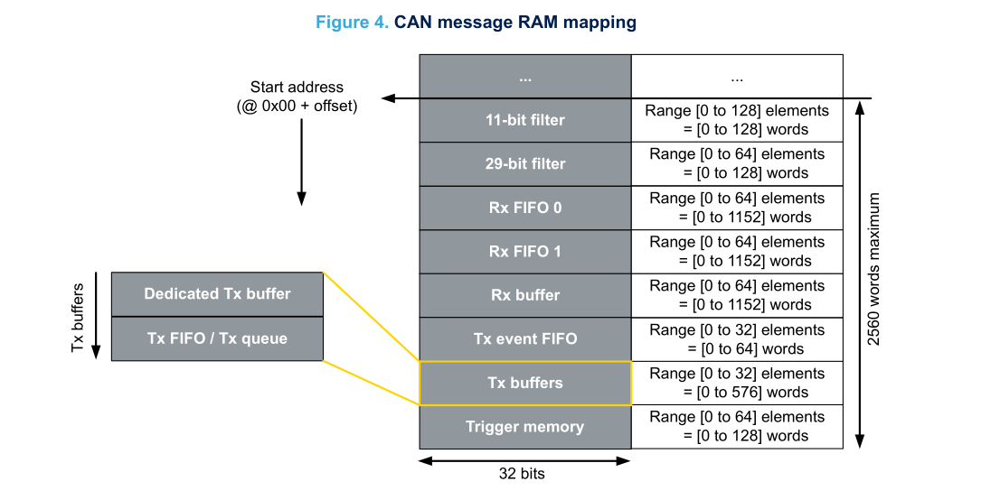

Generally in H7Lib1.0, most peripherals (if not all), have there own ==Peripheral Handle Structure== .

## Features

- Handler-based FDCAN API with message RAM management
- Supports FDCAN1, FDCAN2, FDCAN3 with board-specific port mapping
- Supports both FDCAN and Classic CAN
- Filter configuration and Tx/Rx buffer handling
- FDCAN message RAM size calculation and allocation guidance
- Works with standard and extended CAN frames
- Use of a single handler structure for consistent peripheral state

## Physical ports

- [!Note] that in first version of the board:
	- CAN1 -> FDCAN2 in software.
	- CAN2 -> FDCAN1.
	- CAN3 -> FDCAN3.

## Files

- FDCAN.c
- FDCAN.h


## Peripheral Handle Structure
```c
typedef struct{
	FDCAN_HandleTypeDef *hfdcan;
	FDCAN_RxHeaderTypeDef rxHeader;
	FDCAN_TxHeaderTypeDef txHeader;
	u8 rxData[8];
	u8 txData[8];
	uint8_t filter_count;
	u16 memRAMSize;
	H7_state_e status;
} H7_FDCANHandler_s;

```

- The user is recommended to use the handler for any use of the FDCAN peripheral, to ensure smooth functionality.
- *filter_count* : is for filter offset in case multiple filter are used, user should modify it!
- *memRAMSize* : is for calculating how much memory the FDCAN is occupying in terms of words(32-bit)
- [!warning]These variables should be used for debugging purposes only. And should not be modified.


|  |  |
|:------------------------------------:|:------------------------------------:|
|               FDCAN.h                |               FDCAN.c                |
- The handlers are already configured and ready to use, so there is no need to declare or define them.

## How to use FDCAN
---
### Enable the FDCAN Port
- First thing is to define the FDCAN port we are going to use.
- This can be done in FDCAN.h, by uncommenting the macro.

- The reason is explained in [Message RAM Management](#message-ram-management).

### FDCAN initialization in adapter.c

#### Step 1: Initialize the handler structure
```c
//** Initialize the structure **//

if(H7_FDCANHandler_init(&h7fdcan1, &hfdcan1) != H7_PERIPH_OK){
	Error_Handler();
}
```
- *h7fdcan1* and *hfdcan1*, already declared.

#### Step 2: Initialize the port
```c
//** Configure the port **//
if(H7_FDCAN_init(&h7fdcan1, 1, 1, 16, 0, 32, FDCAN_TX_FIFO_OPERATION, FDCAN_IT_RX_FIFO0_NEW_MESSAGE, FDCAN_1MHz, H7_FDCAN_8_BYTES) != H7_PERIPH_OK){
	Error_Handler();
}
```
- To understand the arguments refer to [Functions](Functions.md) definition for FDCAN.c.

#### Step 3: Creating a filter (Optional) 
```c
//** Initialize filters in case it is needed **//
if(H7_FDCAN_addFilterRange(&h7fdcan1, FDCAN_STANDARD_ID, 0x201, 0x208, FDCAN_FILTER_TO_RXFIFO0) != H7_FDCAN_FILTER_OK){
	Error_Handler();
}
```


## CAN Message RAM
---
- A dedicated RAM reserved to FDCAN is used to allocate up to 2560 words of 32 bits.
- This RAM region is split into 4 sections:
	- Filtering (11-bit and 29-bit filters)
	- Reception (Rx FIFO 0, Rx FIFO 1, Rx Buffer)
	- Transmission (Tx event FIFO, Tx Buffers)
	- Trigger memory (Trigger memory)

|                               |
|:----------------------------------------------:|
| From AN5348 (Introduction to FDCAN peripheral) |

### Size of elements
|            |
| ---------------------------------------------- |
| From AN5348 (Introduction to FDCAN peripheral) |

|         Element          | Size (words)  | Allowable range |
| :----------------------: | :-----------: | :-------------: |
| 11-bit (Standard filter) |       1       |    0 to 128     |
| 29-bit (Extended filter) |       2       |     0 to 64     |
|        Rx FIFO 0         | \*ElementSize |     0 to 64     |
|        Rx FIFO 1         | \*ElementSize |     0 to 64     |
|        Rx Buffer         | \*ElementSize |     0 to 64     |
|      Tx Event FIFO       |       2       |     0 to 32     |
|        Tx buffers        | \*ElementSize |     0 to 32     |
|      Trigger memory      |       2       |     0 to 64     |
#### Determining Elements number
- Generally the bigger the buffer the better.
- ![Note] not to exceed the range specified in [Size of element](#size-of-elements).
	- If rx buffer is 32 then each time the code process, it can process 32 messages.
	- If rx buffer is 8 then each time the code process you will only be able to process 8 messages, if you received 10 messages, only the first 8 will be processed.
	- Required RX FIFO size = (Message arrival rate) × (Processing delay)
- Practical example
	- Rx
		- Messages arrive: 100 msg/second = 1 msg per 10ms - 
		- You process FIFO every: 50ms - 
		- Required size: (100 msg/s) × (0.05s) = 5 messages - Recommendation: Use 8-16 elements (add safety margin)
	- TX FIFO/Queue Size Calculation:
		- Required TX size = (Message generation rate) × (Bus saturation time) 
		- Example:
			- You generate: 50 msg/second
			- Bus can transmit: 100 msg/second
			- Normally no queue needed, but for bursts:
			- If you generate 20 messages at once → need queue of 20+
			- Recommendation: Use 16-32 elements for burst handling


### Message RAM Size Calculation

- This function bellow calculates the taken size of an FDCAN peripheral after initialization.
```c
u16 H7_FDCAN_calcMemSize(H7_FDCANHandler_s *fdcan){
u16 memSize = (fdcan->hfdcan->Init.ExtFiltersNbr * 2) +
(fdcan->hfdcan->Init.StdFiltersNbr * 1) +

(((fdcan->hfdcan->Init.RxFifo0ElmtsNbr * fdcan->hfdcan->Init.RxFifo0ElmtSize) +
(fdcan->hfdcan->Init.RxFifo1ElmtsNbr * fdcan->hfdcan->Init.RxFifo1ElmtSize) +
(fdcan->hfdcan->Init.TxFifoQueueElmtsNbr * fdcan->hfdcan->Init.TxElmtSize) +
(fdcan->hfdcan->Init.TxBuffersNbr * fdcan->hfdcan->Init.TxElmtSize) +
(fdcan->hfdcan->Init.RxBuffersNbr * fdcan->hfdcan->Init.RxBufferSize))) +
(fdcan->hfdcan->Init.TxEventsNbr * 2);

return memSize;
}
```

---

  
  ```c
	fdcan->memRAMSize = H7_FDCAN_calcMemSize(fdcan);
	if(fdcan->memRAMSize >= RAM_SIZE_ALLOW){
	fdcan->status = H7_FDCAN_MEM_RAM_OVERSIZE;
	return H7_FDCAN_MEM_RAM_OVERSIZE;
	}
  ```

The above code is in the [H7_FDCAN_init](Functions.md#h7_fdcan_init) function.
- It is advisable to check the returned value of the [H7_FDCAN_init](Functions.md#h7_fdcan_init) function. And all other functions in general.

### Message RAM Management 
``` c

#define TOTAL_MESSAGE_RAM_WORDS 2560

//#define H7FDCAN1 // User enable this if using
//#define H7FDCAN2 // User enable this if using
//#define H7FDCAN3 // User enable this if using

#if defined(H7FDCAN1) && defined(H7FDCAN2) && defined(H7FDCAN3)
#define FDCAN1_MESSAGE_RAM_OFFSET 0    // Allowable size is 853 words
#define FDCAN2_MESSAGE_RAM_OFFSET 853  // Allowable size is 853 words
#define FDCAN3_MESSAGE_RAM_OFFSET 1706 // Allowable size is 854 words
#define RAM_SIZE_ALLOW 853

#elif defined(H7FDCAN1) && defined(H7FDCAN2) && !defined(H7FDCAN3)
#define FDCAN1_MESSAGE_RAM_OFFSET 0    // Allowable size is 1280 words
#define FDCAN2_MESSAGE_RAM_OFFSET 1280 // Allowable size is 1280 words
#define RAM_SIZE_ALLOW 1280

#elif defined(H7FDCAN1) && !defined(H7FDCAN2) && defined(H7FDCAN3)
#define FDCAN1_MESSAGE_RAM_OFFSET 0    // Allowable size is 1280 words
#define FDCAN3_MESSAGE_RAM_OFFSET 1280 // Allowable size is 1280 words words
#define RAM_SIZE_ALLOW 1280

#elif !defined(H7FDCAN1) && defined(H7FDCAN2) && defined(H7FDCAN3)
#define FDCAN2_MESSAGE_RAM_OFFSET 0    // Allowable size is 1280 words
#define FDCAN3_MESSAGE_RAM_OFFSET 1280 // Allowable size is 1280 words
#define RAM_SIZE_ALLOW 1280

#elif defined(H7FDCAN1) && !defined(H7FDCAN2) && !defined(H7FDCAN3)
#define FDCAN1_MESSAGE_RAM_OFFSET 0 // Allowable size is 2560 words
#define RAM_SIZE_ALLOW 2560

#elif !defined(H7FDCAN1) && defined(H7FDCAN2) && !defined(H7FDCAN3)
#define FDCAN2_MESSAGE_RAM_OFFSET 0 // Allowable size is 2560 words
#define RAM_SIZE_ALLOW 2560

#elif !defined(H7FDCAN1) && !defined(H7FDCAN2) && defined(H7FDCAN3)
#define FDCAN3_MESSAGE_RAM_OFFSET 0 // Allowable size is 2560 words
#define RAM_SIZE_ALLOW 2560

#else
#define RAM_SIZE_ALLOW 0
#endif
```

- Macros definition were used to split CAN Message RAM region equally, depending on how many peripheral are used.
- ![important] Do not forget, defining the used FDCAN by uncommenting it.
- The user can modify the memory offset in case more memory is needed for a specific FDCAN, but the total arrangement should not exceed 2560 words. So changing an FDCAN [Message RAM](#can-message-ram) size, will cause changing others.
## Error handling 
- All functions supports error handling by ==H7_system error handling==. Except *FDCAN_TxMsg()* and *FDCAN_TxMsgEID()* functions, they just return status values without error handling.  

