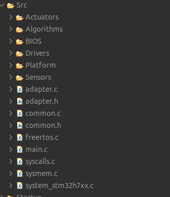
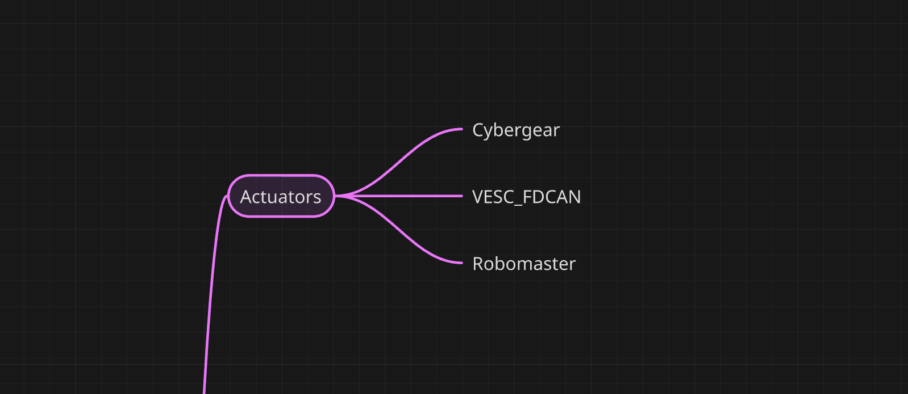
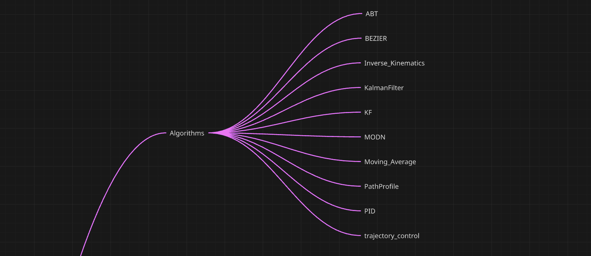
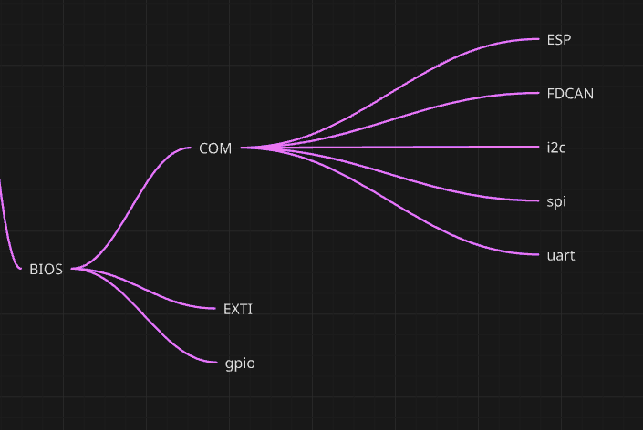
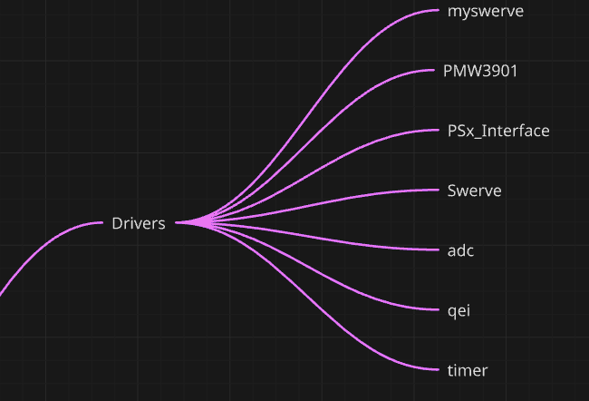
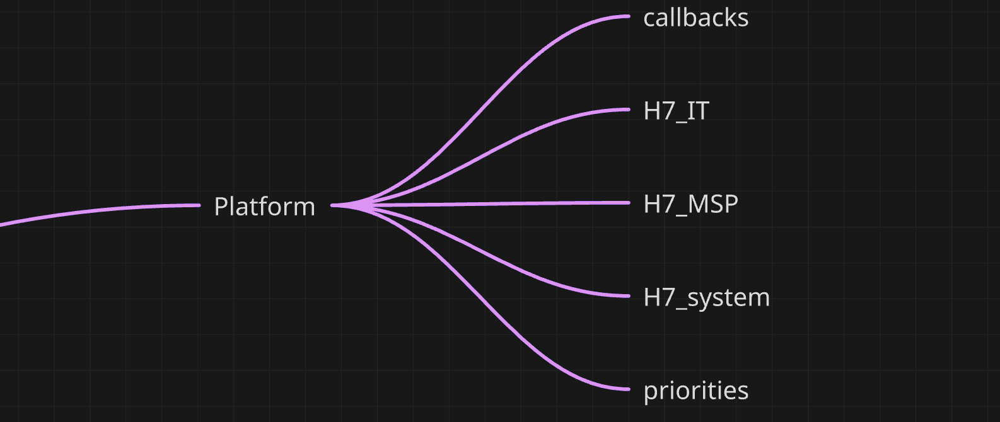
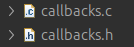
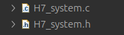
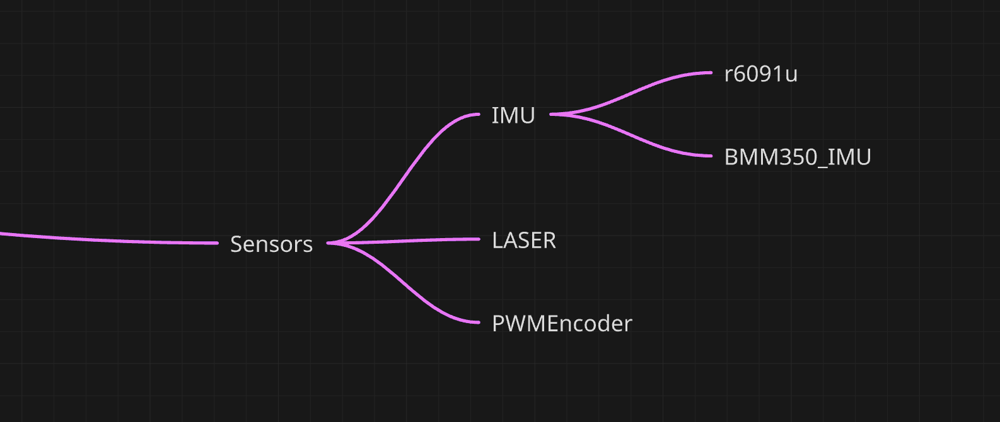
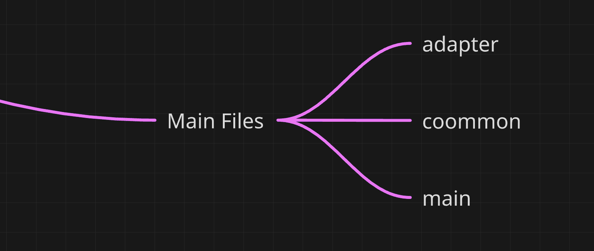

### Versions
@Version 1.0
@author Mohammed Abdulalem

---
This file is general documentation for the structure of H7Lib1.0 library
- Error handling.
- Modified libraries
	- VESC_CAN -> VESC_FDCAN
	- r6091
	- Psx_Interfcae
	- PMW3901

### Notes
- The library has peripheral structure handler for each peripheral.
### Warnings
- ![Note] TIM6 is used for RTOS.
- ![Note] LED6 is used for system, in case ==Error_handler()== is called.

# Library Structure

As the picture explain  itself, these the general files for any library that would be made for robots.
in case a folder need to be added, discuss that with library sub-department.

## Actuators
---

Some of you might ask where is deeptech library?
It will be included in the next library version.

## Algorithms
---

## BIOS

-  Stands for Basic Input Output System, which includes all fundamental peripheral drivers.
-  I also included communication protocols in this folder.

## Drivers

-  I do not know why I choose this folder name, but in general any driver can be put in this folder.

## Platform
---

-  This folder is having files that are related to the core system.
### callbacks

-  This Module contains all the callback functions of most (if not all) peripherals. so the user can put their code there for interrupt event handling.
- It is recommended not put complex processing code inside callback functions, complex functions will cause some problems if they were in callback function. Therefore writing a variable flag then processing it in ***main.c*** file is better.

### H7_IT

- This module is for  global interrupt handling. There is no need to modify this file as the callback module is for interrupt handling for the user.
- The module contains:
	- Cortex Processor Interruption and Exception Handlers
	- Peripheral Interrupt Handlers

### H7_MSP

- Stand for **MCU Support Package** .
- It contains the Clock, GPIO, and Interrupt configuration for the **HAL** *initialization* and *denationalization*  callback functions.
- This file should not be modified.

### H7_system

- This module handle all system core initialization.
- It contain some good features that can be used, brows it.

### Priorities

- This file contains macros that holds the number of different peripherals *PreemptPriority* .
- The number can be modified by user.

## Sensors
---

- These are the sensors can be used for now.
- Note that in this version ADC is not created, hence Laser library can't be used.

## Main files
---

- Adapter module:
	- Used for peripherals initialization.
	- There is an example code commented, already there.
	- Has GPIO macros.
	- Macros for all pins names.
- Common Module
	- This file were the user should write his initialization code for the robot. such as the swerve, motors, algorithms...etc.

# Future improvements
- Implementing status structure inside [H7_system_s](H7_system.md).
- 