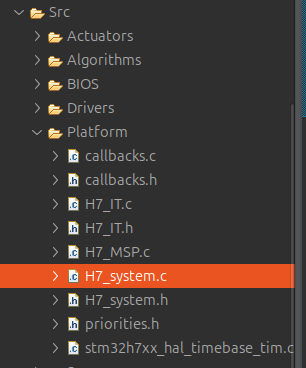

## About
- H7_system module is the overall system core initialization, such as:
	- System clock
	- MPU
	- Cache enable
	- HAL
	- DWT
- The module: 
	- provides an easier format for variable types.
	- Holds state enum for all system and peripherals
	- A special structure for system access and error handling.

## Files

- H7_system module is H7_system.c and H7_system.h files.

## Overall structure

### Special types
```c
///// Signed types /////
typedef __int64_t s64;
typedef __int32_t s32;
typedef __int16_t s16;
typedef __int8_t s8;

// Constant signed types
typedef const __int64_t sc64;
typedef const __int32_t sc32;
typedef const __int16_t sc16;
typedef const __int8_t sc8;

// Volatile signed types
typedef volatile __int64_t vs64;
typedef volatile __int32_t vs32;
typedef volatile __int16_t vs16;
typedef volatile __int8_t vs8;

///// Unsigned types ////
typedef __uint64_t u64;
typedef __uint32_t u32;
typedef __uint16_t u16;
typedef __uint8_t u8;

// Unsigned constant types
typedef const __uint64_t uc64;
typedef const __uint32_t uc32;
typedef const __uint16_t uc16;
typedef const __uint8_t uc8;

// Volatile unsigned types
typedef volatile __uint64_t vu64;
typedef volatile __uint32_t vu32;
typedef volatile __uint16_t vu16;
typedef volatile __uint8_t vu8;
```
- Shorter and faster to write.

### State
```c
typedef enum{
/**************** System states ****************/
H7_STATE_NULL,
H7_OK, // for system and other things
H7_PERIPH_OK, // For Peripherals
/**************** GPIO states ****************/
H7_GPIO_PORT_INV,
/**************** UART states ****************/
H7_UART_NULL_PTR,
H7_UART_PORT_INV,
H7_UART_INIT_ERR,
H7_UART_DMA_INIT_ERR,
/**************** Timer states ****************/
H7_PWM_CHANNEL_OK,
H7_TIM_NULL_PTR,
H7_TIM_INVALID_TIMER,
H7_TIM_INIT_ERR,
H7_TIM_PWM_INIT_ERR,
H7_TIM_TIMEOUT_ERR,
// Configuration Errors
H7_TIM_MASTER_CONF_ERR,
H7_TIM_CLKSOURCE_CONF_ERR,
H7_PWM_CONFIG_CHANNEL_ERR,
H7_TIM_START_Failed,
H7_TIM_START_IT_Failed,
H7_PWM_START_FAILED,
/**************** FDCAN states ****************/
H7_FDCAN_FILTER_OK,
H7_FDCAN_NULL_PTR,
H7_FDCAN_INVALID_PORT,
H7_FDCAN_INIT_ERR,
H7_FDCAN_START_ERR,
H7_FDCAN_FIFO_ACTICATE_ERR,
H7_FDCAN_TIMEOUT_ERR,
H7_FDCAN_FILTER_INIT_ERR,
H7_FDCAN_MEM_RAM_OVERSIZE,
H7_FDCAN_MSGSEND_ERR,
H7_FDCAN_TX_FIFO_FULL,
/**************** I2C states ****************/
H7_I2C_NULL_PTR,
H7_I2C_INVALID_PORT,
H7_I2C_INVALID_SPEED,
H7_I2C_INIT_ERR,
H7_I2C_DMA_INIT_ERR,
H7_I2C_TIMEOUT_ERR,
// Configuration Errors
H7_I2C_AN_FILTER_CONFIG_ERR, // Analog filter
H7_I2C_DG_FILTER_CONFIG_ERR, // Digital filter
H7_I2C_START_IT_Failed,
/**************** QEI states ****************/
H7_QEI_INVALID_PORT,
H7_QEI_INIT_ERR,
/**************** EXTI states ****************/
H7_EXTI_NULL_PTR,
H7_EXTI_INVALID_PIN
} H7_state_e;
```
- This enum is used in all modules, for error handling.


### Register Access
```c
typedef struct{
	union{
		u32 reg_32; // A register container
		struct{
			unsigned bit0 : 1;
			unsigned bit1 : 1;
			unsigned bit2 : 1;
			unsigned bit3 : 1;
			unsigned bit4 : 1;
			unsigned bit5 : 1;
			unsigned bit6 : 1;
			unsigned bit7 : 1;
			unsigned bit8 : 1;
			unsigned bit9 : 1;
			unsigned bit10 : 1;
			unsigned bit11 : 1;
			unsigned bit12 : 1;
			unsigned bit13 : 1;
			unsigned bit14 : 1;
			unsigned bit15 : 1;
			unsigned bit16 : 1;
			unsigned bit17 : 1;
			unsigned bit18 : 1;
			unsigned bit19 : 1;
			unsigned bit20 : 1;
			unsigned bit21 : 1;
			unsigned bit22 : 1;
			unsigned bit23 : 1;
			unsigned bit24 : 1;
			unsigned bit25 : 1;
			unsigned bit26 : 1;
			unsigned bit27 : 1;
			unsigned bit28 : 1;
			unsigned bit29 : 1;
			unsigned bit30 : 1;
			unsigned bit31 : 1;
		};
	};
} H7_word_s;

typedef struct{
	union{
		u16 reg_16; // A 16-bit register container
		struct{
			unsigned bit0 : 1;
			unsigned bit1 : 1;
			unsigned bit2 : 1;
			unsigned bit3 : 1;
			unsigned bit4 : 1;
			unsigned bit5 : 1;
			unsigned bit6 : 1;
			unsigned bit7 : 1;
			unsigned bit8 : 1;
			unsigned bit9 : 1;
			unsigned bit10 : 1;
			unsigned bit11 : 1;
			unsigned bit12 : 1;
			unsigned bit13 : 1;
			unsigned bit14 : 1;
			unsigned bit15 : 1;
		};
	};
} H7_half_word_s;
```
- These structure can be used to access a specific bit of a register.
- Can used for 32-bit and 16-bit registers.

### System struct
```c
typedef struct {
//** System State **//
	struct {
		H7_state_e system; // Overall system state (H7_OK, H7_ERROR, etc.)
		H7_state_e last_error; // Last error that occurred
		u16 error_count; // Total errors since boot
		float cpu_load; // CPU load percentage (0-100%)
		u32 free_heap; // Available heap memory (bytes)
	} status;

	struct {
		vu32 (*get_tick_us)(void); // Microsecond timestamp, use only for micro seconds operations
		u32 (*get_tick_ms)(void); // Millisecond timestamp
		u32 (*get_tick_s)(void); // second timestamp
		void (*delay_us)(u32); // Blocking microsecond delay
		osStatus_t (*delay_ms)(u32); // Blocking millisecond delay
	} time;

// Function related to core
	void (*reset)(void); // Function pointer to soft reset
} H7_System_s;

extern H7_System_s H7SYSTEM;
```
- This structure will make:
	- Debugging for system error easier.
	- More accessibility for repeated used functions.

## Error handling
- The library uses enums to indicate the errors, and in case of a configuration or critical error, *Error_Handler()* will be called, hence the board will stop. To identify the error the macro *H7_ERR_HANDLE()* is used to store the last error happened in the *H7SYSTEM* structure, inside *last_error* member.

### H7_system_init()
- In this function core system configuration happens, along with defining the system structure user functions in the structure *H7SYSTEM*.